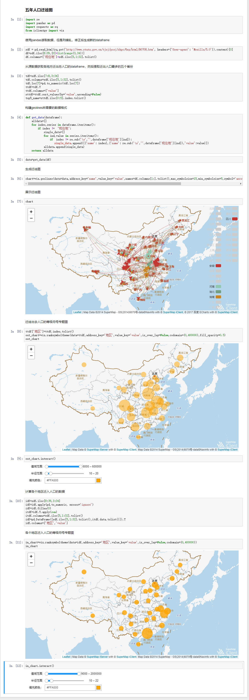

## SuperMap iClient Python

超图云 GIS 客户端 Python SDK。可以与Jupyter Notebook深度结合，进行数据可视化，也可以使用Python进行数据处理然后调用超图云产品进行数据分析，服务发布等。

### 简介

官网：http://iclientpy.supermap.io/

### Samples

### 许可

[ Apache License 2.0 ](./LICENSE)

