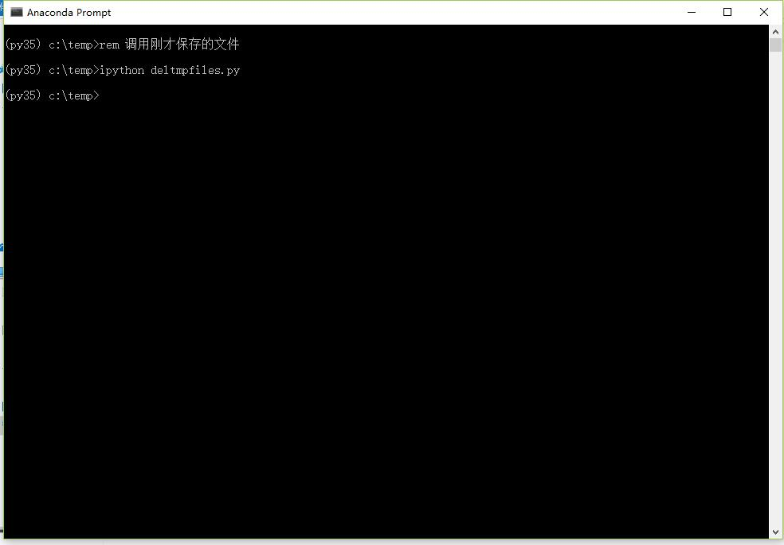

Hello Python
=============

Python是一种很容易使用的编程语言，你甚至可以使用IPython来取代Windows cmd或者Linux shell。
因为可以像使用这两者一样简单的使用Python。

直接调用cmd命令
******************

.. image:: _static/hellopython/dir.jpg

调用cmd命令并把输出结果保存到变量
************************************

.. image:: _static/hellopython/dir_to_var.jpg

写几行代码删除长期不用的临时文件
************************************

.. image:: _static/hellopython/deltmp.jpg

调用保存的程序
************************************

安装Python试试看__

.. __ : https://mirrors.tuna.tsinghua.edu.cn/help/anaconda/