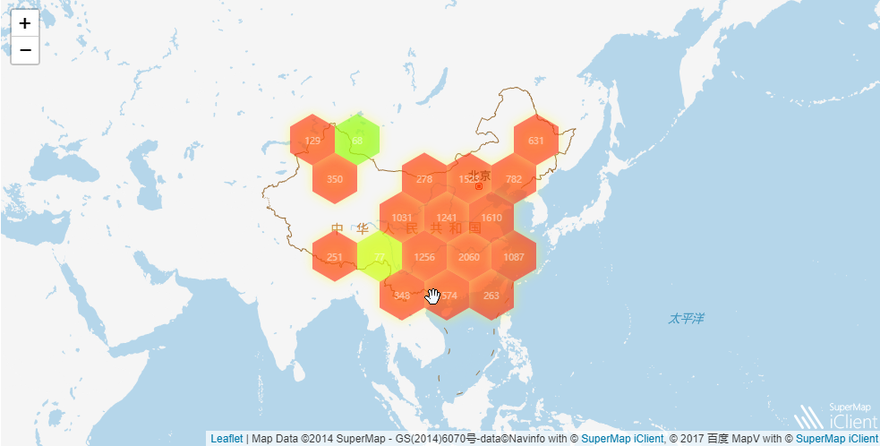

jupyter
===========

介绍
------

当前对接iClient9D的功能有：

* 等级符号专题图_
* 热点图_
* 蜂巢图_

示例
------

.. _等级符号专题图:

等级符号专题图
******************

等级符号专题图示例__

.. __: http://iclientpy.supermap.io/notebooks/work/sample/sample-csv.ipynb

	
.. image:: _static/ranksymbol.png

.. _热点图:

热点图
******

热点图示例__

.. __: http://iclientpy.supermap.io/notebooks/work/sample/sample-heat.ipynb

.. image:: _static/heat.png

.. _蜂巢图:

蜂巢图
******

蜂巢图示例__

.. __ : http://iclientpy.supermap.io/notebooks/work/sample/sample-mapv.ipynb

