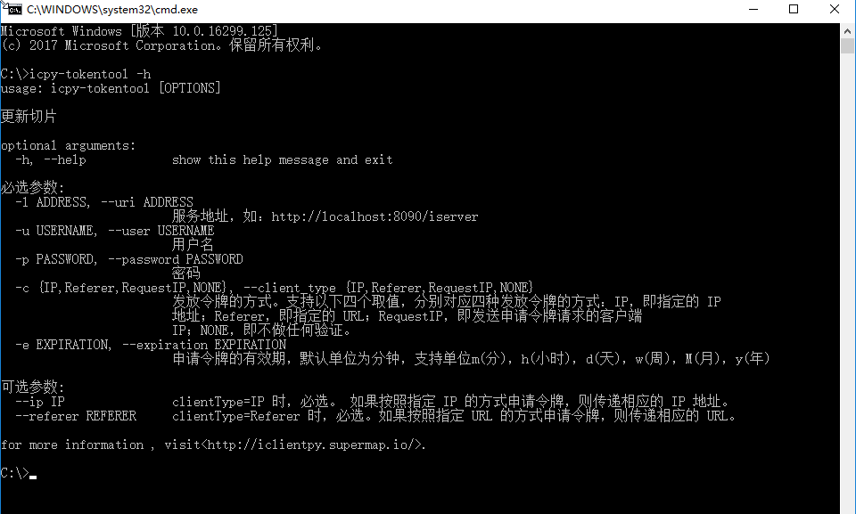

命令行工具
======================
这部分主要介绍iclientpy中所默认提供的命令行工具

* 缓存工具_
* token工具_

缓存工具
*****************
icpy-cachetool

-l ADDRESS, --uri ADDRESS   服务地址，如：http://localhost:8090/iserver
-u USERNAME, --user USERNAME    用户名
-p PASSWORD, --password PASSWORD    密码
-c COMPONENT_NAME, --component-name COMPONENT_NAME  待更新缓存服务名称
-w W_LOC, --w-loc W_LOC     工作空间路径
-m MAP_NAME, --map-name MAP_NAME    切图地图名称
-o ORIGINAL_POINT, --original-point ORIGINAL_POINT      切图原点，需以单引号开始和结束，如：'-180,90'
-b CACHE_BOUNDS, --bounds CACHE_BOUNDS  缓存范围，需以单引号开始和结束，如：'-180,-90,0,0'
-s SCALE, --scale SCALE     缓存比例尺分母，如：8000000,4000000,2000000
--service-type W_SERVICETYPE    工作空间服务类型
--tile-size TILE_SIZE   切片大小
--tile-type TILE_TYPE   切片类型
--format FORMAT     切片输出格式
--epsgcode EPSG_CODE    投影
--storageid STORAGEID   存储id
-rw     输入的工作空间地址是远程iServer所在服务器上的地址，不需要上传工作空间。
--quite     不需要确认，直接运行
--source-component SOURCE_COMPONENT_NAME    缓存更新数据来源服务
--update    更新服务缓存

.. image:: _static/icpy-cachetool.png

示例：
icpy-cachetool -l http://localhost:8090/iserver -u admin -p iserver -c map-smtiles-World -w C:\World.zip -m World -o '-180,90' -b '-180,-90,0,90'

icpy-cachetool -l http://localhost:8090/iserver -u admin -p iserver -c map-smtiles-World -m World -o '-180,90' -b '-180,-90,0,90' --source-component map-World --update

token工具
******************
icpy-tokentool

-l ADDRESS, --uri ADDRESS          服务地址，如：http://localhost:8090/iserver
-u USERNAME, --user USERNAME       用户名
-p PASSWORD, --password PASSWORD   密码
-c CLIENT_TYPE, --client_type CLIENT_TYPE        发放令牌的方式。支持以下四个取值，分别对应四种发放令牌的方式：IP，即指定的 IP地址；Referer，即指定的 URL；RequestIP，即发送申请令牌请求的客户端IP；NONE，即不做任何验证。
-e EXPIRATION, --expiration EXPIRATION    申请令牌的有效期，默认单位为分钟，支持单位m(分)，h(小时)，d(天)，w(周)，M(月)，y(年)
--ip IP    clientType=IP 时，必选。 如果按照指定 IP 的方式申请令牌，则传递相应的 IP 地址。
--referer REFERER    clientType=Referer 时，必选。如果按照指定 URL 的方式申请令牌，则传递相应的 URL。

示例：
 icpy-tokentool -l http://localhost:8090/iserver -u admin -p iserver -c NONE -e 60

